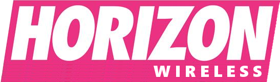

# family-bundle-calculator
I began to test out some React lately and wanted to polish up on some vanilla JavaScript first.

I took a basic exercise from YDKJS (You Don't Know JavaScript) about affording a phone under a budget threshhold and wanted to create something more advanced and practical.

This project is mainly built for more vanilla JS. Design aspect is for fun. And because clean-cut is 👌

## Horizon Wireless

Horizon Wireless is the Unofficial mobile phone sponsor for all Forza Horizon events.

  

Design inspired by &copy; Forza Horizon 4's racing world (of which there are many in-game events).